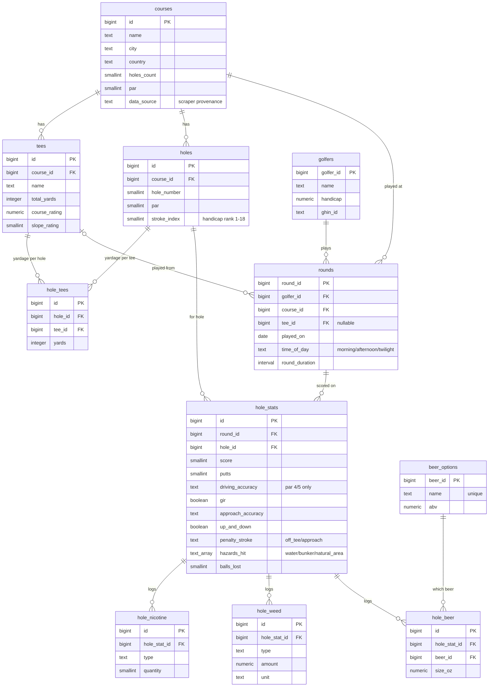

# golf-stats

A personal golf statistics dashboard for monitoring and improving your game.

Think of it as a GHIN dashboard — but with deeper, more advanced, and fully
customizable statistics. Instead of just tracking a handicap and recent scores,
`golf-stats` lets you drill into your game **hole by hole**, build your own
metrics, and surface insights that off-the-shelf golf apps don't provide.

## Vision

Most golf tracking tools give you a handicap, a scoring average, and maybe a few
basic stats (fairways hit, greens in regulation, putts per round). `golf-stats`
aims to go much further:

- **Hole-by-hole analysis** — track and review performance on every hole of
  every course you play, not just round-level aggregates.
- **Advanced & custom statistics** — define your own metrics (e.g. strokes
  gained by category, scoring by hole type, performance under specific
  conditions) and monitor them over time.
- **Automated course data** — an agent scrapes the web for golf course
  information (layout, yardages, par, slope/rating, hole details) based on the
  courses you input, so you don't have to enter everything by hand.
- **A dashboard you control** — the end product is a dashboard (web app or
  native app) where you can plug in and visualize the custom statistics that
  matter most to you.

## How it works

1. **Course data ingestion** — A scraping agent ([`scraper/`](scraper)) takes a
   course name, searches the web, and extracts course details (tees, hole
   yardages, par, stroke index, slope, and course rating) into the database.
2. **Round entry** — You log rounds hole-by-hole in the web app: score, putts,
   driving/approach accuracy, GIR, penalties, hazards, balls lost, and on-course
   beer/nicotine/weed consumption.
3. **Stats** — A `round_stats` view rolls the hole-level data up to round
   totals; the API aggregates further (scoring average, GIR %, fairway %, etc.).
4. **Dashboard** — The Next.js app ([`web/`](web)) surfaces per-golfer stats and
   trends, and provides the round-entry UI.

## Architecture

```
scraper/ (Python + Gemini + Tavily)
        ↓ writes courses
   Postgres  ──  db/schema.sql
        ↑ reads / writes
   api/ (FastAPI)  ──JSON──  web/ (Next.js + React PWA)
```

- **Scraper** ([`scraper/`](scraper)) — Python agent: Tavily web search → fetch
  & clean pages → Gemini structured extraction → insert into Postgres.
- **Data layer** ([`db/schema.sql`](db/schema.sql)) — PostgreSQL schema for
  courses, tees, holes, golfers, rounds, and hole-by-hole stats (see ERD below).
- **API** ([`api/`](api)) — FastAPI service exposing golfers, courses, rounds,
  the beer catalog, and aggregated stats as JSON.
- **Web app** ([`web/`](web)) — Next.js + React + Tailwind + Recharts PWA: a
  GHIN/18Birdies-style entry flow plus per-golfer visualization, on phone and
  desktop from one codebase.

## Status

🟢 **Working vertical slice.** The scraper, database, API, and web app are all
built and runnable. Next up: advanced and user-defined custom statistics, and
broader external golf-data API integrations (see the roadmap).

## Data model

The full schema lives in [`db/schema.sql`](db/schema.sql). The diagram below
(an entity-relationship diagram) shows how the tables connect. `round_stats` is
a view that aggregates `hole_stats` up to the round level, so it isn't shown.



### Where the database lives

The repo only contains the schema (`db/schema.sql`) — **not** the database
itself. The live data is stored by your local PostgreSQL server, not as a file
in this project. On this machine (Homebrew Postgres 14):

| Detail | Value |
| --- | --- |
| Database name | `golf_stats` |
| Server data directory | `/opt/homebrew/var/postgresql@14` (server-managed; don't edit by hand) |
| Host / Port | `localhost` / `5432` |
| User | `timmarkel` (local trust auth — no password) |

Create it from scratch (e.g. on a new machine):

```bash
brew services start postgresql@14     # start the server
createdb golf_stats                   # create the database
psql golf_stats -f db/schema.sql      # apply the schema
```

Quick CLI access: `psql golf_stats` (then `\dt` to list tables).

### Viewing the data in Postico

1. Make sure the server is running: `brew services start postgresql@14`.
2. Open **Postico** → **New Server / New Favorite**.
3. Enter:
   - **Nickname:** `golf-stats` (anything)
   - **Host:** `localhost`
   - **Port:** `5432`
   - **User:** `timmarkel`
   - **Password:** *(leave blank — local trust auth)*
   - **Database:** `golf_stats`
4. Click **Connect**. You'll see the tables (`courses`, `golfers`, `rounds`,
   `beer_options`, …) in the left sidebar; click one to browse rows, and use the
   SQL Query tab for ad-hoc queries.

## Course scraper

The `scraper/` package is the course-data ingestion tool. You give it a course
name and an LLM agent searches the web, reads the resulting pages, and extracts
a structured record (course details, tee sets, and hole-by-hole par / stroke
index / yardages) that it writes into the database.

**Pipeline:** `course name → Tavily web search → fetch & clean pages → Gemini
structured extraction → insert into Postgres`

### Setup

```bash
python3 -m venv .venv && source .venv/bin/activate
pip install -r requirements.txt
cp .env.example .env   # then fill in your keys
```

You'll need two free API keys in `.env`:

- `GEMINI_API_KEY` — Google AI Studio (https://aistudio.google.com/apikey)
- `TAVILY_API_KEY` — Tavily search (https://app.tavily.com)

And a running Postgres database with the schema applied:

```bash
createdb golf_stats
psql golf_stats -f db/schema.sql
```

### Usage

```bash
# Preview the extracted data without touching the database:
python -m scraper.cli "Pebble Beach Golf Links, Pebble Beach, CA" --dry-run

# Scrape and write the course into the database:
python -m scraper.cli "Pebble Beach Golf Links, Pebble Beach, CA"
```

## Web app (API + dashboard)

The app is split into a backend API and a frontend, both sitting on top of the
Postgres database:

- **`api/`** — a FastAPI service exposing golfers, courses, rounds, and
  aggregated stats as JSON.
- **`web/`** — a Next.js (React + Tailwind) app with a GHIN/18Birdies-style
  hole-by-hole round-entry flow and a per-golfer visualization page (scoring
  trend, putts, GIR %, fairway %, round history). Installable as a PWA, so it
  works on both phone and desktop from one codebase.

```
Postgres → FastAPI (api/) → Next.js (web/)
```

### Run the backend

```bash
source .venv/bin/activate            # same venv as the scraper
pip install -r api/requirements.txt
uvicorn api.main:app --reload        # serves http://localhost:8000 (docs at /docs)
```

It reads `DATABASE_URL` from `.env` (defaults to `postgresql://localhost:5432/golf_stats`).

### Run the frontend

```bash
cd web
npm install
cp .env.local.example .env.local     # points at http://localhost:8000 by default
npm run dev                          # serves http://localhost:3000
```

Add a course with the scraper first (so there's something to log rounds
against), then open the app, create a golfer, and start a round.

## Roadmap

- [x] Define data model for courses and holes
- [x] Build the course-scraping agent
- [x] Build the API (FastAPI) over the data model
- [x] Build the dashboard / app front end (Next.js: entry UI + golfer stats)
- [ ] Integrate external golf data APIs
- [ ] Implement the stats engine (advanced + user-defined custom metrics)
- [ ] Add support for user-defined custom statistics
